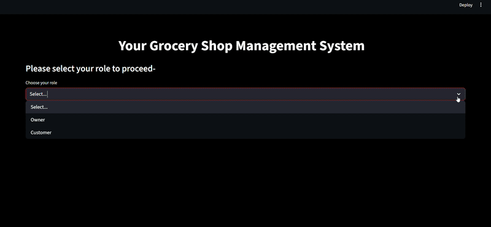

-----

````markdown
# Grocery Shop Management System (Streamlit App)



A comprehensive grocery management system built with Streamlit and MySQL. This application provides a dual-interface for:

1.  **Owners:** To manage inventory, track sales, and view customer data.
2.  **Customers:** To purchase items and generate downloadable PDF invoices.

## Features

### 👨‍💼 Owner Dashboard
* **View Inventory:** Display all items in the shop in a clean table.
* **Add New Items:** A dedicated form to add new products to the database (Name, Category, Quantity, Price).
* **Update Items:** Update the quantity and price of any existing item using its ID.
* **Delete Items:** Remove items from the inventory.
* **View Customer Data:** See a list of all customers who have made purchases.
* **Sales Analytics:** View a bar chart of the top 5 best-selling items to understand product performance.

### 🧑‍🛒 Customer Portal
* **Browse Products:** View a list of all available items, including price and stock.
* **Add to Cart:** Select quantities for multiple items to purchase.
* **Checkout Form:** Enter personal details (Name, Phone, Email, Address) to complete the purchase.
* **Live Inventory Update:** When a purchase is confirmed, the database is updated in real-time to reflect the new stock levels.
* **PDF Invoice Generation:** Automatically generates a detailed PDF invoice (using FPDF) upon successful purchase.
* **Download Bill:** A download button appears instantly, allowing the customer to save their bill.

## 🛠️ Technologies Used

* **Python:** Core programming language.
* **Streamlit:** For building the interactive web application UI.
* **MySQL:** As the backend database (`mysql-connector-python`).
* **Pandas:** For data handling and displaying dataframes.
* **Matplotlib:** For generating the "Top 5 Items" bar chart.
* **FPDF (`pyfpdf`):** For generating the PDF invoices.

## 🚀 Setup and Installation

Follow these steps to run the project on your local machine.

### 1. Clone the Repository
```bash
git clone [https://github.com/your-username/your-repository-name.git](https://github.com/your-username/your-repository-name.git)
cd your-repository-name
````

### 2\. Create a Virtual Environment (Recommended)

```bash
# For Windows
python -m venv venv
venv\Scripts\activate

# For macOS/Linux
python3 -m venv venv
source venv/bin/activate
```

### 3\. Install Dependencies

Create a file named `requirements.txt` in your project folder and add the following lines:

```
streamlit
pandas
matplotlib
mysql-connector-python
fpdf
```

Then, install them all using pip:

```bash
pip install -r requirements.txt
```

### 4\. Database Setup

This project requires a MySQL server.

1.  **Install MySQL** on your machine (e.g., using XAMPP, WAMP, or MySQL Community Server).

2.  **Start** your MySQL service.

3.  **Open** a MySQL client (like phpMyAdmin or the MySQL command line) and run the following SQL queries to create the database and tables:

    ```sql
    -- 1. Create the database
    CREATE DATABASE GROCERY_SHOP;

    -- 2. Use the new database
    USE GROCERY_SHOP;

    -- 3. Create the ITEMS table
    CREATE TABLE ITEMS (
      ID INT AUTO_INCREMENT PRIMARY KEY,
      NAME_OF_ITEMS VARCHAR(255) NOT NULL,
      CATEGORY VARCHAR(100),
      QUANTITY INT DEFAULT 0,
      PER_UNIT_PRICE DECIMAL(10, 2) DEFAULT 0.00
    );

    -- 4. Create the CUSTOMER table
    CREATE TABLE CUSTOMER (
      ID INT AUTO_INCREMENT PRIMARY KEY,
      NAME VARCHAR(255) NOT NULL,
      PHONE_NUMBER VARCHAR(20),
      EMAIL_ADDRESS VARCHAR(255),
      ADDRESS TEXT,
      TOTAL_PURCHASE DECIMAL(10, 2),
      REGISTERED_DATE DATETIME
    );

    -- 5. Create the SELL table to track sales
    CREATE TABLE SELL (
      ID INT AUTO_INCREMENT PRIMARY KEY,
      ITEM_ID INT,
      NO_OF_UNIT_SOLD INT,
      FOREIGN KEY (ITEM_ID) REFERENCES ITEMS(ID)
    );
    ```

### 5\. Update Database Connection

Open the Python script (`your_app_name.py`) and modify the `get_db_connection` function with your MySQL credentials (especially the **password**):

```python
def get_db_connection():
    try:
        conn = mysql.connector.connect(
            host="localhost",
            user="root",
            password="",  # <-- ADD YOUR MYSQL PASSWORD HERE
            database="GROCERY_SHOP"
        )
        return conn
    except mysql.connector.Error as err:
        st.error(f"Error connecting to database: {err}")
        return None
```

### 6\. Add Local Images

This app uses local images for the Owner dashboard. Make sure you have the following images in the same folder as your Python script:

  * `show.png`
  * `add.png`
  * `update.jpg`
  * `delete.png`
  * `customer.png`
  * `top.png`

## 🏃‍♂️ How to Run the App

1.  Make sure your MySQL server is running.

2.  Open your terminal, activate your virtual environment, and navigate to the project directory.

3.  Run the following Streamlit command:

    ```bash
    streamlit run your_app_name.py
    ```

    (Replace `your_app_name.py` with the actual name of your Python file).

4.  Streamlit will open the application in your default web browser (usually at `http://localhost:8501`).

## 📄 License

This project is licensed under the MIT License.

```
```
